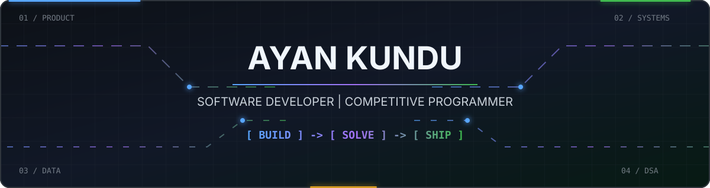
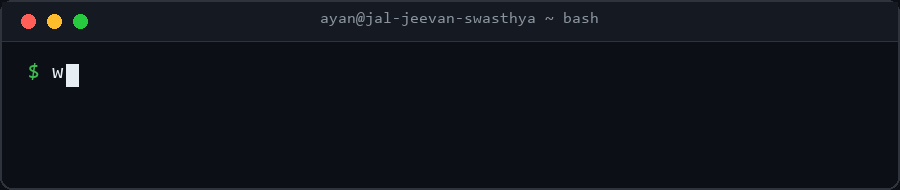
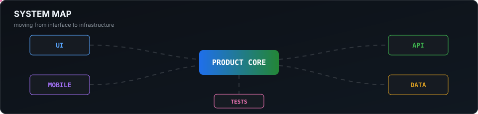

## About

Passionate Computer Science student driven by curiosity and continuous learning.
Building projects in Full Stack Development and AI while strengthening problem-solving skills.
Striving to create impactful technology and grow into a software engineer who delivers real value.

## Professional Channels

## Selected Work

| Project | What it does | Built with |
| --- | --- | --- |
| [Jal Jeevan Swasthya](https://github.com/harshitgupta31415/prisma-visualizer) | Smart Community Health Monitoring & Early Warning System | FastAPI, Next.js, React |
| [Focusflow-x-ai--Deep-Work-Companion](https://github.com/ayankunduixb-pixel/Focusflow-x-ai--Deep-Work-Companion) | AI-powered futuristic productivity app for students to achieve deep focus, track productivity, and build consistent study habits.| React, Tailwind CSS |
| [Mental Health Score Predictor](https://github.com/harshitgupta31415/blood-donation-analysis) | A Machine Learning-powered web application that predicts a user's Mental Health Score based on daily lifestyle, digital habits, academic routine, sleep, physical activity, and stress level. | Python, FastAPI, Pydantic, Scikit-Learn |

## Competitive Programming

Generated from the official Codeforces API every six hours. 
[LeetCode: 250+ solved, contest rating 1470](https://leetcode.com/u/Ayan1Kundu/)

## Working Stack

| Area | Tools |
| --- | --- |
| Product | Next.js, React, Node.js, Flutter, Prisma |
| Languages | Python, C, C++, TypeScript, JavaScript, Dart, SQL |
| Data and delivery | Pandas, NumPy, Matplotlib, Git, Vercel ,Render|

## Contribution Activity

